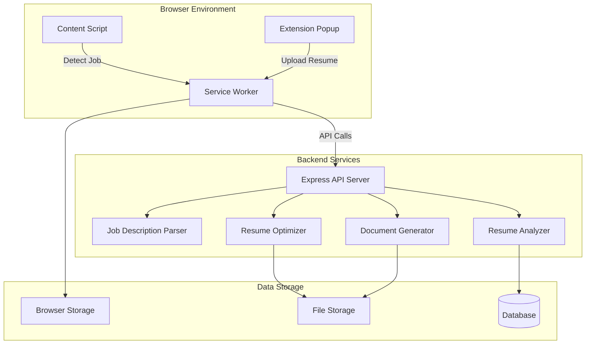

# Design Document

## Overview

The ATS Resume Optimizer is a comprehensive system consisting of three integrated components: a Chrome extension for job description detection and user interaction, a backend service for intelligent resume analysis and optimization, and a document processing pipeline for multi-format support. The system leverages natural language processing techniques, keyword extraction algorithms, and ATS-specific optimization rules to enhance resume compatibility with Applicant Tracking Systems while maintaining authenticity and professional quality.

### Key Design Principles

1. **User-Centric Experience**: Minimize user effort through automatic detection and one-click optimization
2. **Privacy-First**: Process sensitive resume data securely with encryption and automatic cleanup
3. **Accuracy Over Speed**: Prioritize quality of optimization over processing time
4. **Transparency**: Show users exactly what changes are made and why
5. **Platform Agnostic**: Support multiple job boards and career websites

## Architecture

### High-Level Architecture



### Component Interaction Flow

1. **Job Detection Flow**: Content Script → Service Worker → Backend Parser → Storage
2. **Resume Upload Flow**: Extension Popup → Service Worker → Backend API → File Storage
3. **Analysis Flow**: Service Worker → Resume Analyzer → ATS Score Calculation → Response
4. **Optimization Flow**: Service Worker → Resume Optimizer → Enhanced Resume → Document Generator → Download
5. **History Flow**: Extension Popup → Browser Storage → Display

## Components and Interfaces

### 1. Chrome Extension Components

#### 1.1 Content Script (content-script.js)

**Purpose**: Runs on job posting pages to detect and extract job descriptions

**Key Responsibilities**:
- Detect job description presence on supported websites
- Extract job title, company, requirements, and full description text
- Inject visual indicators when job descriptions are detected
- Handle manual text selection fallback
- Communicate with service worker

**Site-Specific Selectors**:
```javascript
const SITE_SELECTORS = {
  'linkedin.com': {
    jobTitle: '.job-details-jobs-unified-top-card__job-title',
    company: '.job-details-jobs-unified-top-card__company-name',
    description: '.jobs-description__content'
  },
  'indeed.com': {
    jobTitle: '.jobsearch-JobInfoHeader-title',
    company: '[data-company-name="true"]',
    description: '#jobDescriptionText'
  },
  'glassdoor.com': {
    jobTitle: '[data-test="job-title"]',
    company: '[data-test="employer-name"]',
    description: '.jobDescriptionContent'
  }
}
```

**Detection Algorithm**:
1. Identify current website domain
2. Apply site-specific selectors
3. Validate extracted content (minimum length, required fields)
4. Calculate confidence score (0-100)
5. If confidence > 80%, display indicator; otherwise enable manual mode

**Interface**:
```javascript
// Message to Service Worker
{
  type: 'JOB_DETECTED',
  payload: {
    jobTitle: string,
    company: string,
    description: string,
    requirements: string[],
    skills: string[],
    url: string,
    confidence: number
  }
}
```

#### 1.2 Service Worker (service-worker.js)

**Purpose**: Background process managing communication between extension components and backend

**Key Responsibilities**:
- Route messages between content script, popup, and backend API
- Manage authentication tokens
- Handle file uploads and downloads
- Cache frequently accessed data
- Manage browser storage operations

**API Communication Layer**:
```javascript
class APIClient {
  constructor(baseURL) {
    this.baseURL = baseURL;
    this.token = null;
  }
  
  async analyzeResume(jobDescription, resumeText) {
    // POST /api/analysis/analyze
  }
  
  async optimizeResume(analysisId, preferences) {
    // POST /api/analysis/optimize
  }
  
  async generateDocument(optimizedResumeId, format) {
    // POST /api/documents/generate
  }
}
```

#### 1.3 Extension Popup (popup.html/js)

**Purpose**: Main user interface for the extension

**UI Sections**:

1. **Job Detection Panel**: Shows detected job info with manual input option
2. **Resume Upload Panel**: Drag-and-drop or file picker for resume upload
3. **Analysis Results Panel**: Displays ATS score, matched/missing keywords
4. **Optimization Panel**: Shows side-by-side comparison with change highlights
5. **Download Panel**: Format selection and download button
6. **History Panel**: List of previous optimizations

**State Management**:
```javascript
const ExtensionState = {
  currentJob: null,
  uploadedResume: null,
  analysisResult: null,
  optimizedResume: null,
  history: [],
  settings: {
    autoDetect: true,
    apiEndpoint: 'http://localhost:5000'
  }
}
```

### 2. Backend Service Components

#### 2.1 Job Description Parser

**Purpose**: Extract structured data from raw job description text

**Parsing Strategy**:
1. **Section Identification**: Use regex patterns and NLP to identify sections (requirements, qualifications, responsibilities)
2. **Keyword Extraction**: Extract technical skills, soft skills, tools, and technologies
3. **Requirement Classification**: Categorize as required vs preferred
4. **Experience Level Detection**: Identify years of experience and seniority level

**Algorithm**:
```javascript
class JobDescriptionParser {
  parse(jobDescription) {
    const sections = this.identifySections(jobDescription);
    const keywords = this.extractKeywords(sections);
    const requirements = this.classifyRequirements(keywords);
    const metadata = this.extractMetadata(jobDescription);
    
    return {
      sections,
      keywords: {
        technical: [],
        soft: [],
        tools: [],
        certifications: []
      },
      requirements: {
        required: [],
        preferred: []
      },
      metadata: {
        experienceLevel: '',
        yearsRequired: 0
      }
    };
  }
}
```

**Keyword Extraction Techniques**:
- Dictionary-based matching against skill databases
- N-gram extraction for multi-word skills (e.g., "machine learning")
- Context-aware extraction using surrounding words
- Frequency analysis to identify important terms

#### 2.2 Resume Analyzer

**Purpose**: Evaluate resume against job requirements and calculate ATS score

**Analysis Components**:

1. **Resume Parser**: Extract structured data from resume text
   - Contact information
   - Work experience (company, title, dates, bullets)
   - Education (degree, institution, dates)
   - Skills section
   - Certifications

2. **Keyword Matcher**: Compare resume keywords against job keywords
   - Exact matches
   - Synonym matches (e.g., "JS" = "JavaScript")
   - Contextual matches (skill mentioned in experience)

3. **ATS Score Calculator**: Multi-factor scoring algorithm

**ATS Score Formula**:
```javascript
ATSScore = (
  keywordMatchScore * 0.40 +
  experienceRelevanceScore * 0.25 +
  skillsAlignmentScore * 0.20 +
  formattingScore * 0.10 +
  completenessScore * 0.05
) * 100

// Each component scored 0-1
```

**Scoring Breakdown**:
- **Keyword Match (40%)**: Percentage of job keywords found in resume
- **Experience Relevance (25%)**: Relevance of past roles to target role
- **Skills Alignment (20%)**: Match between listed skills and required skills
- **Formatting (10%)**: ATS-friendly formatting (no tables, images, proper sections)
- **Completeness (5%)**: Presence of all standard sections

**Interface**:
```javascript
class ResumeAnalyzer {
  async analyze(resumeText, jobDescription) {
    const resumeData = await this.parseResume(resumeText);
    const jobData = await this.parseJobDescription(jobDescription);
    
    return {
      atsScore: number,
      matchedKeywords: string[],
      missingKeywords: string[],
      matchedSkills: string[],
      missingSkills: string[],
      suggestions: string[],
      breakdown: {
        keywordMatch: number,
        experienceRelevance: number,
        skillsAlignment: number,
        formatting: number,
        completeness: number
      }
    };
  }
}
```

#### 2.3 Resume Optimizer

**Purpose**: Generate enhanced resume version optimized for ATS and specific job

**Optimization Strategies**:

1. **Keyword Integration**:
   - Add missing keywords naturally into existing experience bullets
   - Enhance skills section with relevant technologies from job posting
   - Avoid keyword stuffing (maintain readability)

2. **Content Reordering**:
   - Prioritize most relevant experience at the top
   - Reorder bullet points to highlight matching achievements
   - Move relevant skills to prominent positions

3. **Action Verb Enhancement**:
   - Replace weak verbs with strong action verbs
   - Align verb choice with job description language
   - Maintain past/present tense consistency

4. **Quantification**:
   - Suggest adding metrics where missing
   - Highlight existing quantifiable achievements

5. **Section Optimization**:
   - Ensure all standard sections are present
   - Add missing sections if beneficial (e.g., Certifications)
   - Remove or minimize irrelevant sections

**Optimization Rules**:
```javascript
const OPTIMIZATION_RULES = {
  maxKeywordDensity: 0.03, // 3% keyword density max
  minBulletPoints: 3,
  maxBulletPoints: 5,
  actionVerbs: ['Led', 'Developed', 'Implemented', 'Designed', 'Managed', 'Achieved'],
  forbiddenPhrases: ['Responsible for', 'Duties included', 'Worked on'],
  requiredSections: ['Experience', 'Education', 'Skills'],
  optionalSections: ['Certifications', 'Projects', 'Publications']
}
```

**Change Tracking**:
```javascript
class ChangeTracker {
  trackChange(type, location, original, modified, reason) {
    return {
      type: 'keyword_added' | 'content_reordered' | 'verb_enhanced' | 'section_added',
      location: 'experience.0.bullets.2',
      original: string,
      modified: string,
      reason: string,
      impact: 'high' | 'medium' | 'low'
    };
  }
}
```

#### 2.4 Document Generator

**Purpose**: Convert optimized resume text into downloadable formats (PDF, DOCX, TXT)

**Format Handlers**:

1. **PDF Generation**:
   - Library: PDFKit or Puppeteer
   - Preserve formatting, fonts, spacing
   - Ensure ATS-readable (no images, proper text layers)

2. **DOCX Generation**:
   - Library: docx.js
   - Use standard Word formatting
   - Maintain compatibility with ATS parsers

3. **TXT Generation**:
   - Plain text with proper line breaks
   - Section headers with clear delimiters

**Template System**:
```javascript
class DocumentGenerator {
  async generate(resumeData, format, template = 'professional') {
    const templates = {
      professional: {
        font: 'Arial',
        fontSize: 11,
        margins: { top: 0.5, bottom: 0.5, left: 0.75, right: 0.75 },
        colors: { primary: '#000000', accent: '#333333' }
      },
      modern: {
        font: 'Calibri',
        fontSize: 11,
        margins: { top: 0.5, bottom: 0.5, left: 0.75, right: 0.75 },
        colors: { primary: '#1a1a1a', accent: '#0066cc' }
      }
    };
    
    const generator = this.getGenerator(format);
    return await generator.create(resumeData, templates[template]);
  }
}
```

### 3. API Endpoints

#### Resume Analysis Endpoints

**POST /api/analysis/analyze**
```javascript
Request: {
  jobDescription: string,
  resumeText: string,
  resumeFile?: File
}

Response: {
  analysisId: string,
  atsScore: number,
  matchedKeywords: string[],
  missingKeywords: string[],
  matchedSkills: string[],
  missingSkills: string[],
  suggestions: string[],
  breakdown: object
}
```

**POST /api/analysis/optimize**
```javascript
Request: {
  analysisId: string,
  preferences: {
    aggressiveness: 'conservative' | 'moderate' | 'aggressive',
    preserveFormatting: boolean,
    targetScore: number
  }
}

Response: {
  optimizedResumeId: string,
  originalAtsScore: number,
  optimizedAtsScore: number,
  changes: Change[],
  optimizedText: string
}
```

**GET /api/analysis/history**
```javascript
Response: {
  history: [{
    id: string,
    jobTitle: string,
    company: string,
    originalScore: number,
    optimizedScore: number,
    createdAt: timestamp
  }]
}
```

#### Document Generation Endpoints

**POST /api/documents/generate**
```javascript
Request: {
  optimizedResumeId: string,
  format: 'pdf' | 'docx' | 'txt',
  template: 'professional' | 'modern'
}

Response: {
  downloadUrl: string,
  expiresAt: timestamp
}
```

**POST /api/documents/upload**
```javascript
Request: FormData {
  file: File,
  userId: string
}

Response: {
  fileId: string,
  extractedText: string,
  metadata: {
    filename: string,
    size: number,
    format: string
  }
}
```

## Data Models

### Resume Model
```javascript
{
  id: string,
  userId: string,
  originalText: string,
  parsedData: {
    contact: {
      name: string,
      email: string,
      phone: string,
      location: string,
      linkedin?: string
    },
    summary?: string,
    experience: [{
      company: string,
      title: string,
      startDate: string,
      endDate: string,
      bullets: string[]
    }],
    education: [{
      institution: string,
      degree: string,
      field: string,
      graduationDate: string
    }],
    skills: string[],
    certifications?: string[]
  },
  createdAt: timestamp,
  updatedAt: timestamp
}
```

### Analysis Model
```javascript
{
  id: string,
  resumeId: string,
  jobDescription: {
    title: string,
    company: string,
    fullText: string,
    parsedKeywords: string[],
    parsedSkills: string[],
    requirements: string[]
  },
  atsScore: number,
  scoreBreakdown: {
    keywordMatch: number,
    experienceRelevance: number,
    skillsAlignment: number,
    formatting: number,
    completeness: number
  },
  matchedKeywords: string[],
  missingKeywords: string[],
  suggestions: string[],
  createdAt: timestamp
}
```

### OptimizedResume Model
```javascript
{
  id: string,
  analysisId: string,
  originalResumeId: string,
  optimizedText: string,
  changes: [{
    type: string,
    location: string,
    original: string,
    modified: string,
    reason: string,
    impact: string
  }],
  newAtsScore: number,
  scoreImprovement: number,
  createdAt: timestamp,
  expiresAt: timestamp
}
```

## Error Handling

### Extension Error Handling

1. **Network Errors**: Retry with exponential backoff, show user-friendly message
2. **File Upload Errors**: Validate file size/format before upload, clear error messages
3. **Detection Failures**: Fallback to manual input mode
4. **Storage Errors**: Clear cache and retry, notify user if persistent

### Backend Error Handling

1. **Parsing Errors**: Return partial results with warnings
2. **API Rate Limiting**: Implement request queuing and throttling
3. **File Processing Errors**: Clean up temporary files, return detailed error
4. **Database Errors**: Retry transient errors, log persistent errors

**Error Response Format**:
```javascript
{
  error: {
    code: string,
    message: string,
    details?: object,
    retryable: boolean
  }
}
```

## Testing Strategy

### Unit Testing

1. **Keyword Extraction**: Test with various job descriptions
2. **Resume Parsing**: Test with different resume formats and structures
3. **ATS Score Calculation**: Verify scoring algorithm accuracy
4. **Optimization Logic**: Ensure changes maintain authenticity

### Integration Testing

1. **Extension-Backend Communication**: Test all API endpoints
2. **File Upload/Download Flow**: Test all supported formats
3. **Job Detection**: Test on actual job board pages
4. **End-to-End Optimization**: Complete flow from detection to download

### Performance Testing

1. **Analysis Speed**: Target < 10 seconds for analysis
2. **Optimization Speed**: Target < 15 seconds for optimization
3. **Document Generation**: Target < 5 seconds per format
4. **Concurrent Users**: Test with 100+ simultaneous requests

### Security Testing

1. **File Upload Validation**: Test malicious file uploads
2. **XSS Prevention**: Test content script injection safety
3. **Data Encryption**: Verify encryption at rest and in transit
4. **Authentication**: Test token expiration and refresh

## Security Considerations

### Data Protection

1. **Encryption**: AES-256 for data at rest, TLS 1.3 for data in transit
2. **File Cleanup**: Automatic deletion of temporary files after 24 hours
3. **Access Control**: User-specific data isolation
4. **Audit Logging**: Track all data access and modifications

### Extension Security

1. **Content Security Policy**: Restrict script execution
2. **Permission Minimization**: Request only necessary permissions
3. **Secure Communication**: HTTPS-only API calls
4. **Input Sanitization**: Sanitize all user inputs and extracted content

### API Security

1. **Authentication**: JWT-based authentication
2. **Rate Limiting**: Prevent abuse with request limits
3. **Input Validation**: Validate all request parameters
4. **CORS Configuration**: Restrict to extension origin

## Performance Optimization

### Caching Strategy

1. **Browser Storage**: Cache user resumes and recent analyses
2. **API Response Caching**: Cache job description parses for 1 hour
3. **CDN**: Serve static assets via CDN

### Processing Optimization

1. **Async Processing**: Use worker threads for heavy computations
2. **Batch Operations**: Process multiple analyses in parallel
3. **Lazy Loading**: Load extension components on demand
4. **Debouncing**: Debounce user inputs to reduce API calls

## Deployment Architecture

### Extension Distribution

1. **Chrome Web Store**: Primary distribution channel
2. **Version Management**: Semantic versioning
3. **Auto-Updates**: Leverage Chrome's auto-update mechanism

### Backend Deployment

1. **Containerization**: Docker containers for consistent deployment
2. **Load Balancing**: Distribute traffic across multiple instances
3. **Monitoring**: Application performance monitoring and logging
4. **Scaling**: Horizontal scaling based on load

### Infrastructure

1. **API Server**: Node.js/Express on cloud platform (AWS, GCP, Azure)
2. **File Storage**: S3 or equivalent for temporary file storage
3. **Database**: MongoDB or PostgreSQL for structured data
4. **Queue System**: Redis or RabbitMQ for async job processing
